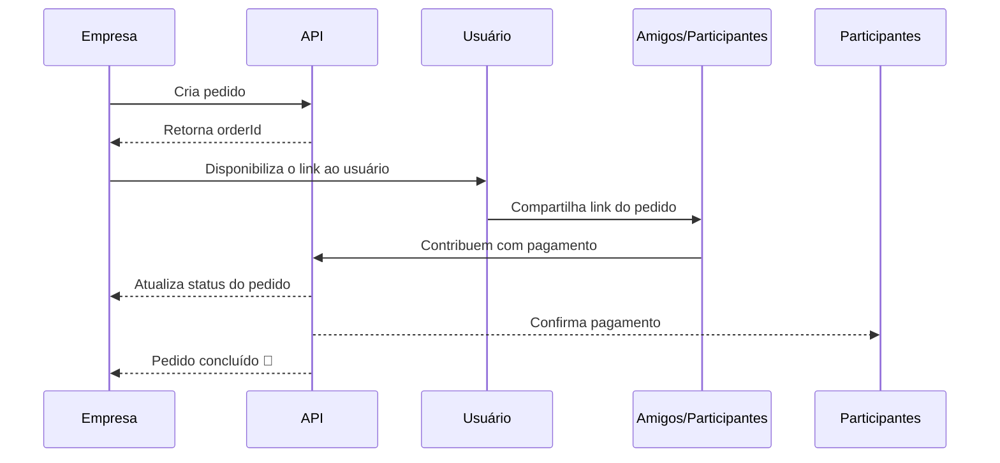

# PagJunto

O **PagJunto** é um **checkout compartilhado B2B**, pensado para empresas que querem oferecer a possibilidade de dividir pagamentos diretamente dentro de seus próprios apps ou plataformas. Ele permite que múltiplos usuários paguem uma mesma compra de forma simples e transparente.

---

## 🔗 Repositórios

* **[pagjunto](https://github.com/matheuscursino/pagjunto)** → site em Node.js com templates EJS, responsável por renderizar as páginas de criação e acompanhamento de pedidos.
* **[api-pagjunto](https://github.com/matheuscursino/api-pagjunto)** → API que gerencia os pedidos, pagamentos e integrações, servindo como backend para qualquer app que queira usar o PagJunto.

---

## ⚙️ Como funciona

1. A empresa integra o PagJunto em seu checkout.
2. Um pedido é criado na API do PagJunto.
3. O usuário compartilha o link do pedido com amigos ou participantes do pagamento.
4. Cada participante acessa o link e contribui com sua parte.
5. A API atualiza o status do pedido conforme os pagamentos são realizados.
6. Quando o valor total é atingido, o pedido é marcado como **pago** e a empresa é notificada. ✅

Exemplo de fluxo:

---

## 🎯 Motivação

O PagJunto nasceu da ideia de criar uma **solução B2B completa** de checkout compartilhado. A meta foi desenvolver algo que empresas pudessem integrar facilmente em seus apps, mostrando domínio de **Node.js, EJS e arquitetura de API**, com fluxo de pagamento intuitivo para usuários finais.

---
